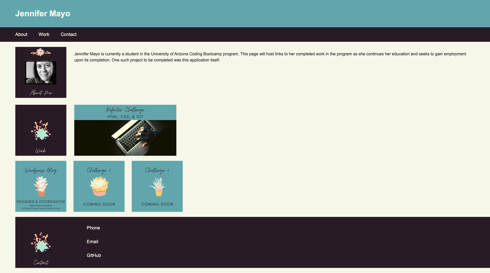

# challenge-02 Advanced CSS Challenge: Professional Portfolio

## **Table of Contents**
* [The Repository](#the-repository-br)
* [The Scenario](#the-scenario)
* [The Process](#the-process)
* [Requirements Met](#requirements-met)
* [Result](#result)
* [Contributors](#contributors)

### **The Repository**
This repository (challenge-02) contains HTML code, a CSS stylesheet, and image attachments for the stylesheet for the construction of a web application that is a portfolio page for Week 2 of University of Arizona Coding Boot Camp.

### **The Scenario**
The task was to construct a web application, in this case a deployed portfolio page, to house work samples for potential employers to review. 

### **The Process**
No starter code was provided for this project. I created the HTML and a CSS Stylesheet.

### **Requirements Met**
* The portfolio contains the developer's name, a recent photo, links to sections about them, their work, and their contact information.
* Clickable links in the navigation bar scroll through the UI to the appropriate sections
* Clicking on the Work link scrolls to a section that features titled images of the developer's applications
* In the Work section, the first clickable image is larger than the others and navigation points to the developer's first application
* In the Work section, the smaller, clickable images point to other deployed applications

### **Requirements Outstanding**
* At first attempt, responsive layout is not functional
* No comments have yet been made in the HTML or CSS

### **Result**
Most of the requirements were met. If grading occurs before I can add responsive layout, then I will submit an additional attempt once I have a chance to solicit help from tutors, instructors, or classmates.

The web page is very basic for now, but there is time and room to grow as I learn new skills.

### **Contributors**
While the refactored code is my own, I had tremendous help from classmates in study sessions, my instructor and TA in office hours, and from my tutor in getting Git to work properly, recognizing and editing errors in the nav bar, and in consolidating the CSS code. 

You can find my site at [Challenge-02](https://jlmayo.github.io/challenge-02/)

## **Completed Project**

